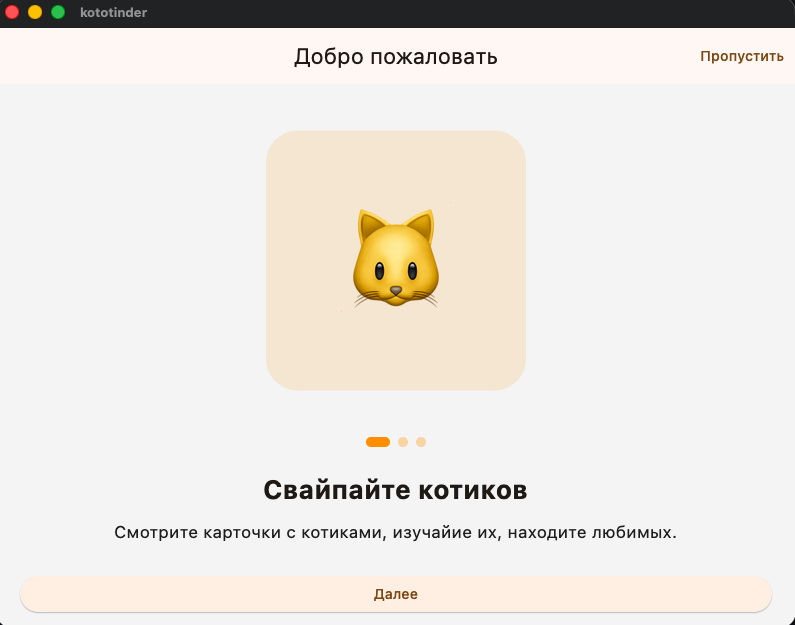
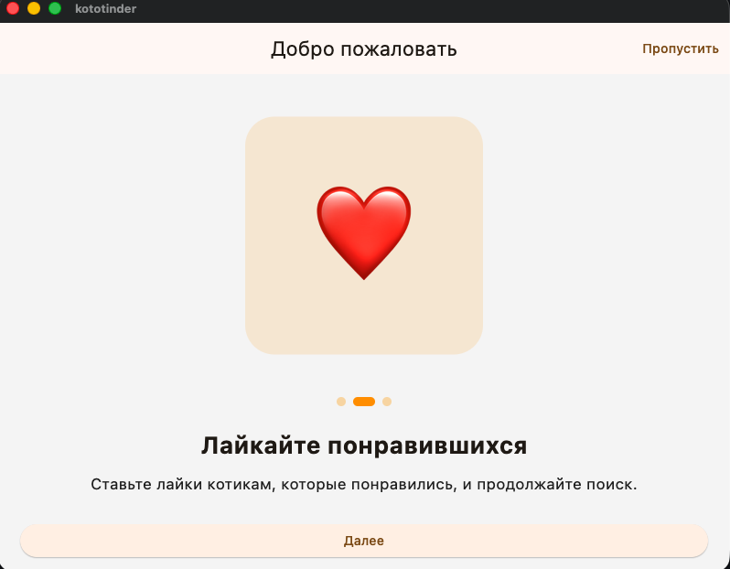
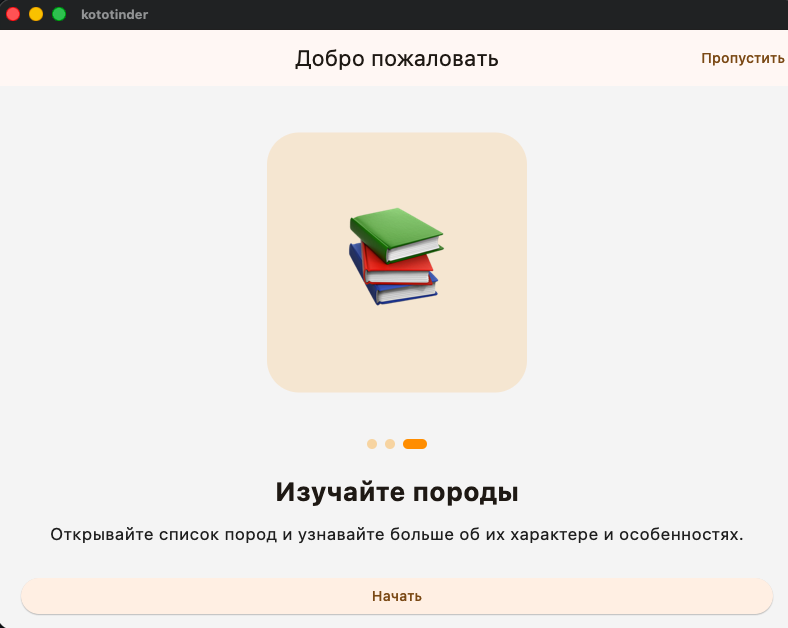
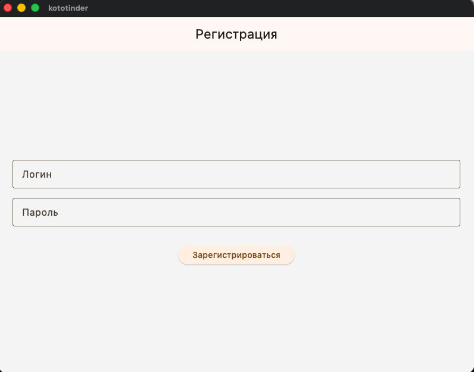
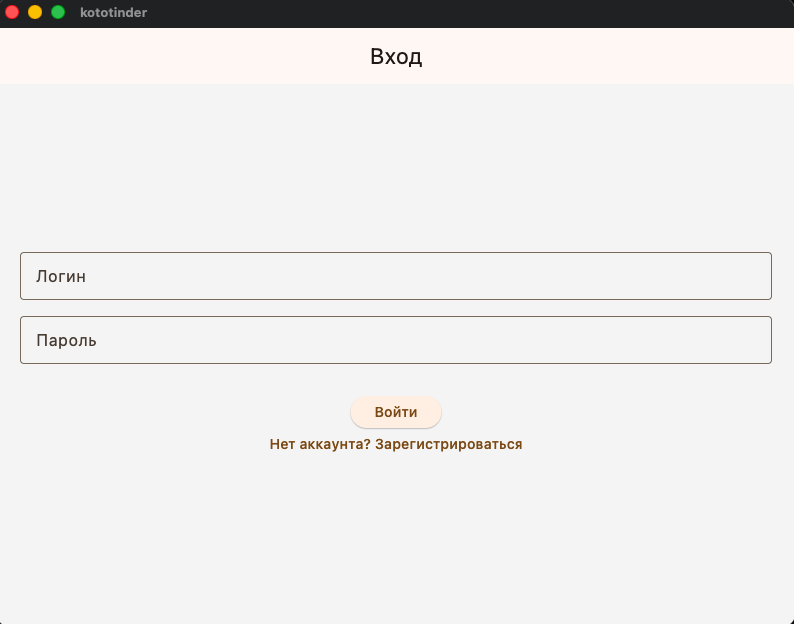
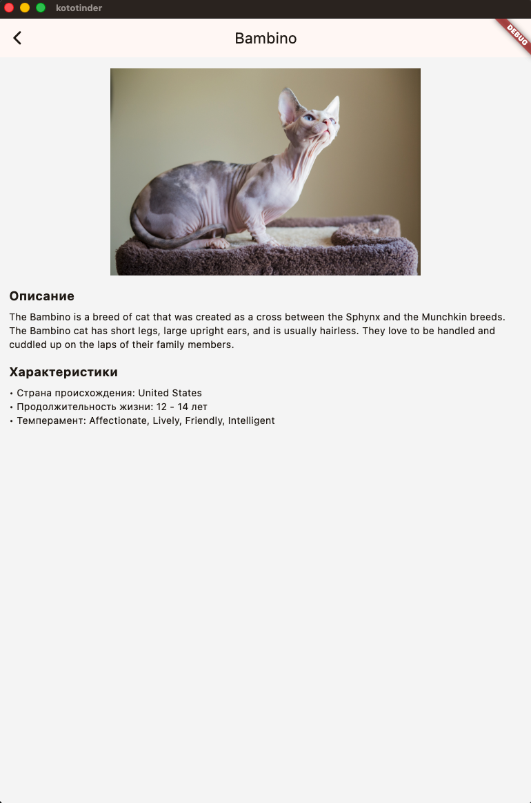
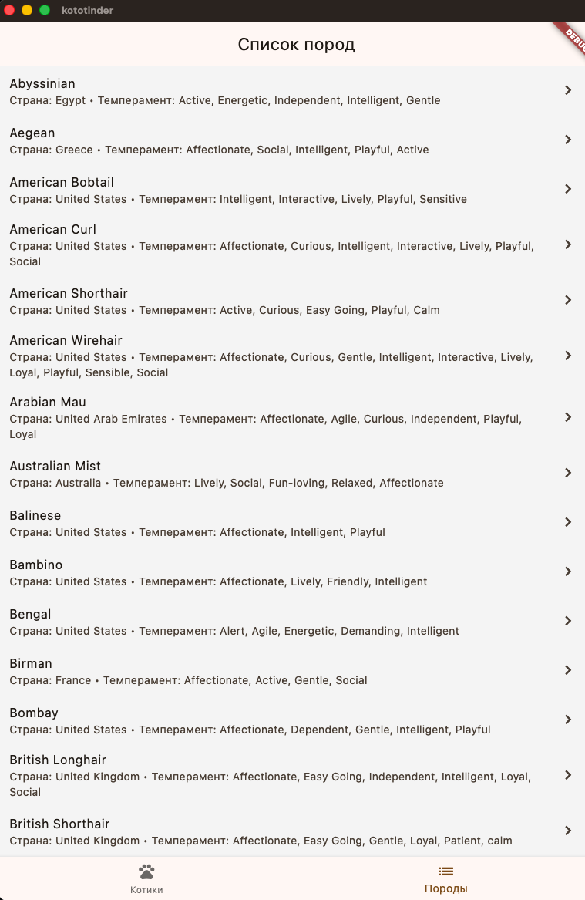
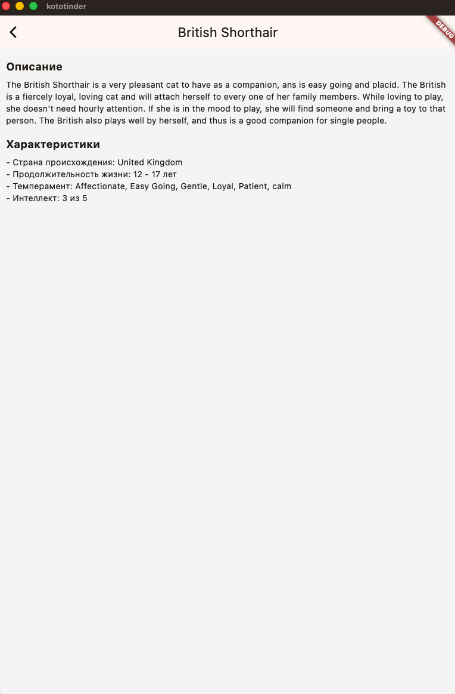

# Кототиндер!!!!!!!!!!
Косталевский Даниил, БПИ-236

Приложение Кототиндер позволяет лайкать или дизлайкать котиков (по нажатию на кнопку или свайпнув), просматривать информацию о породе, а также смотреть вообще все породы, которые нам доступны по API.

Проект включает в себя слоистую архитектуру, тестирование, CI и продуктовую аналитику.

---

# Функциональность

### Onboarding
При первом запуске приложение показывает onboarding из нескольких экранов с описанием возможностей приложения.

### Регистрация и авторизация
Пользователь может:
- зарегистрироваться
- войти в аккаунт
- выйти из аккаунта

Данные пользователя сохраняются локально.

### Просмотр котиков
Пользователь может:
- просматривать случайных котиков
- свайпать карточки
- ставить лайки
- открывать детали породы

### Список пород
Отдельный экран со списком пород кошек и подробной информацией о каждой породе.

---

# Архитектура

Проект использует разделение на слои:

### Слои

**data**
- работа с API
- модели данных
- data sources

**domain**
- сущности приложения

**presentation**
- UI
- экраны
- взаимодействие пользователя

---

# Аналитика

В приложении настроена отправка событий в Firebase Analytics.

Реализованные события:

register_success - спешная регистрация
login_success - успешный вход
login_failed - ошибка входа
logout - выход из аккаунта
onboarding_completed - завершение онбординга
cat_liked - пользователь поставил лайк коту
breed_opened - пользователь открыл породу

---

# Тестирование

В проекте реализованы widget-tests и unit-tests:

- тест onboarding
- тест login screen
- тест перехода к регистрации
- тест корректного парсинга ответа API кота
- тест корректного парсинга породы
- текст корректной обработки отсутствующих полей JSON

Тесты запускаются автоматически в CI.

---

# CI / GitHub Actions

В проекте настроен CI через GitHub Actions.

пайплайн автоматически выполняет:

---

### Из фичей:
- Загружаем случайного кота через API.
- Отображаем имя породы.
- Можем лайкнуть и дизлайкнуть котика с помощью кнопки либо же с помощью свайпа: направо - лайк (и увеличивается количество лайков), налево - дизлайк и показывается новый котик.
- При нажатии на фотографию кота мы можем просмотреть всю информацию о нем: описание породы, страну ее происхождения, продолжительность жизни и темперамент.
- На экране "Список пород" мы также можем посмотреть информацию о породе - все вышеперечисленное.

В рамках разработки проекта был использован пакет http для запросов, Image.network для отображения картинок. Ошибки обрабатываются (а сетевые еще и через окно). Код отформатирован с помощью dart format, линтер подключен и команда flutter analyze не дает никаких ошибок, то есть работает успешно. Есть кастомная иконка!

### Фотографии приложения

Ссылка на APK: https://disk.360.yandex.ru/d/epkEyZfl8zsx9g